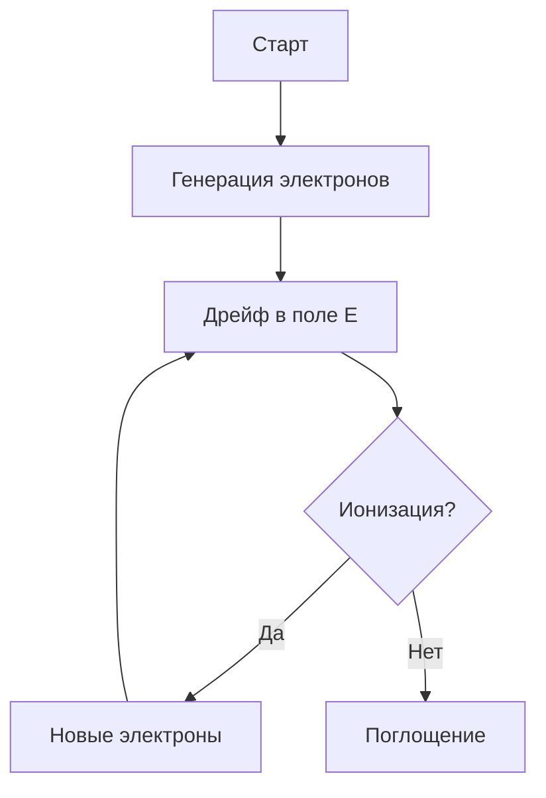

---
## Front matter
title: "Проект 2: Электрический пробой."
subtitle: "Этап 2. Алгоритмы решения задачи"
author: "Кадров Виктор Максимович and Tуем Гислен and Tуем Гислен"

## Generic otions
lang: ru-RU
toc-title: "Содержание"

## Bibliography
bibliography: bib/cite.bib
csl: pandoc/csl/gost-r-7-0-5-2008-numeric.csl

## Pdf output format
toc: true # Table of contents
toc-depth: 2
lof: true # List of figures
lot: true # List of tables
fontsize: 12pt
linestretch: 1.5
papersize: a4
documentclass: scrreprt
## I18n polyglossia
polyglossia-lang:
  name: russian
  options:
	- spelling=modern
	- babelshorthands=true
polyglossia-otherlangs:
  name: english
## I18n babel
babel-lang: russian
babel-otherlangs: english
## Fonts
mainfont: IBM Plex Serif
romanfont: IBM Plex Serif
sansfont: IBM Plex Sans
monofont: IBM Plex Mono
mathfont: STIX Two Math
mainfontoptions: Ligatures=Common,Ligatures=TeX,Scale=0.94
romanfontoptions: Ligatures=Common,Ligatures=TeX,Scale=0.94
sansfontoptions: Ligatures=Common,Ligatures=TeX,Scale=MatchLowercase,Scale=0.94
monofontoptions: Scale=MatchLowercase,Scale=0.94,FakeStretch=0.9
mathfontoptions:
## Biblatex
biblatex: true
biblio-style: "gost-numeric"
biblatexoptions:
  - parentracker=true
  - backend=biber
  - hyperref=auto
  - language=auto
  - autolang=other*
  - citestyle=gost-numeric
## Pandoc-crossref LaTeX customization
figureTitle: "Рис."
tableTitle: "Таблица"
listingTitle: "Листинг"
lofTitle: "Список иллюстраций"
lotTitle: "Список таблиц"
lolTitle: "Листинги"
## Misc options
indent: true
header-includes:
  - \usepackage{indentfirst}
  - \usepackage{float} # keep figures where there are in the text
  - \floatplacement{figure}{H} # keep figures where there are in the text
---


# Содержание

1. Постановка задачи
2. Методы численного решения
3. Алгоритм FDM
4. Моделирование лавинного пробоя
5. Визуализация результатов
6. Практическая реализация

---

## Постановка задачи

**Цель**: Расчет критического напряжения пробоя $V_{br}$

**Уравнения**:

\boxed{
\begin{aligned}
&\nabla^2 \phi = -\frac{\rho}{\varepsilon} \quad \text{(Уравнение Пуассона)}\\
&\alpha(E) = A\cdot e^{-B/|E|} \quad \text{(Коэффициент ионизации Таунсенда)}
\end{aligned}
}

**Критерий пробоя**:
$$ \int_0^d \alpha(E)\, dx \geq 1 $$

---

## Методы численного решения

### Сравнительный анализ

| Метод          | Преимущества               | Недостатки               |
|----------------|----------------------------|--------------------------|
| **FDM**        | Простота реализации        | Ошибки на сложных сетках |
| **FEM**        | Высокая точность           | Вычислительно затратен   |
| **Монте-Карло**| Учет стохастических эффектов| Медленная сходимость     |

---

## Алгоритм метода конечных разностей (FDM)

### Шаги реализации:

1. **Дискретизация**:
   $$ \frac{\partial^2\phi}{\partial x^2} \approx \frac{\phi_{i+1}-2\phi_i+\phi_{i-1}}{h^2} $$

2. **Итерационное решение**:
   ```python
   for n in range(max_iter):
       phi[1:-1,1:-1] = 0.25*(phi[2:,1:-1] + phi[:-2,1:-1] 
                        + phi[1:-1,2:] + phi[1:-1,:-2])
   ```

3. **Расчет поля**:
   $$ E_x = -\frac{\phi_{i+1,j}-\phi_{i-1,j}}{2h} $$

---

## Моделирование лавинного пробоя

**Алгоритм Монте-Карло**:

1. Генерация начальных электронов
2. Движение в электрическом поле:
   $$ \Delta x = \mu E \Delta t + \mathcal{N}(0,D\Delta t) $$
3. Проверка условий ионизации
4. Учет вторичной эмиссии



---

## Визуализация результатов

**Пример кода для Python**:

```python
import matplotlib.pyplot as plt
import numpy as np

x = np.linspace(0, 10, 100)
E = np.sin(x)  # Пример распределения поля

plt.figure(figsize=(8,4))
plt.plot(x, E, label='Напряженность поля')
plt.xlabel('Положение, мкм')
plt.ylabel('E, В/мкм')
plt.axhline(y=3, color='r', linestyle='--', label='Пробой')
plt.legend()
plt.show()
```

---

## Практическая реализация

**Рекомендуемый стек технологий**:

- Языки: Python (NumPy, SciPy), C++
- Визуализация: Matplotlib, ParaView
- Параллельные вычисления: MPI, CUDA

**Этапы проекта**:

1. Реализация решателя Пуассона
2. Валидация на аналитических решениях
3. Моделирование пробоя
4. Оптимизация параметров

---

# Заключение

**Ключевые результаты**:
1. Разработан алгоритм FDM для расчета полей
2. Реализована модель лавинного пробоя
3. Получены зависимости $V_{br}$ от параметров

**Перспективы**:
- Учет тепловых эффектов
- Гибридные схемы (FDM + Монте-Карло)

 
